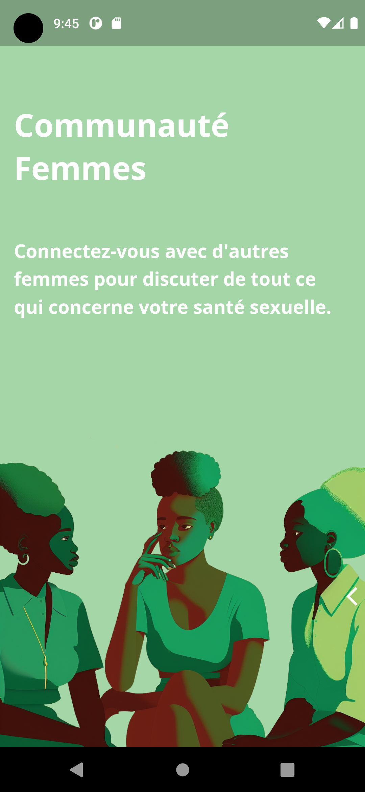

  
   
  

# Introduction ☕

This project was undertaken as part of the course "Introduction to Product Development and Management for Engineers and Computer Scientists" at the University of Ottawa. Collaborated directly with a client to fulfill their product requirements. My aim was to create a mobile application focused on improving women's sexual health. The app provides reliable and accessible information on genital health care, contraception, sexually transmitted infections (STIs), and sexual violence. Additionally, the app includes functionalities to help users track their menstrual cycles and schedule appointments with specialists.

Client was an assoctiation based in Africa and their objectives were:

- Awareness.
- Prevention.
- Digitizing the association to reach a larger audience.

# Client Requirements Ranked by Their Subjective Importance

| Number | Client Statements                                                       | Interpreted Needs                                           | Importance | Design Criteria      |
| ------ | ----------------------------------------------------------------------- | ----------------------------------------------------------- | ---------- | -------------------- |
| 1      | Easy-to-understand application for users with a lower educational level | Application adapted to literacy level, multiple visual aids | 5          | Cognitive Aids       |
| 2      | Access to profiles, a forum, discussion space, and general information  | Different user access levels                                | 5          | Access Levels        |
| 3      | Addition of private forums and discussion spaces (platforms)            | Adding forums and private discussions                       | 4          | Discussion Platforms |
| 4      | Spaces for user-provided information                                    | Espaces de renseignements mis par les utilisateurs          | 3          | Educational          |
| 5      | Android-compatible application                                          | Accessible via an Android device (website or application)   | 3          | Compatibility        |
| 6      | Blank interface for healthcare specialists                              | Dedicated section for healthcare professionals              | 5          | Access Levels        |
| 7      | Colors reflecting those of the association                              | Color scheme representing the association Heroine du Faso   | 2          | Aesthetic            |
| 8      | Logo of the association                                                 | Represent the association Heroine du Faso                   | 3          | Aesthetic            |
| 9      | Presence of icons                                                       | Allow users to easily navigate the application              | 5          | Visual Aids          |
| 10     | Sound guides                                                            | Facilitate application usage with sound aids                | 2          | Sound Aids           |
| 11     | Anonymity for users who desire it                                       | Anonymity option                                            | 4          | Anonymity            |

# Problem Statement

Our client needs a mobile application compatible with Android devices that is easy to use for everyone and primarily allows awareness and education for women and young girls regarding reproduction and their sexual health. This application should feature multiple interfaces with different access levels specific to each user category; specifically, healthcare professionals, association members, and the general public.

# Conclusion

To conclude, the client needs a mobile application that is accessible and compatible with Android to promote education on women's sexual health and facilitate connections between women/girls and healthcare professionals. Therefore, it's crucial to define design criteria and clear target specifications that can guide us throughout the design process. Moreover, this document details the steps that led us to choose a concept suited for our ideal product and the client's needs.

### Software Features and Documentation

##### Authentication using Firebase

- **Purpose**: To securely manage user access by different roles (admin, manager, healthcare professional, public user) in one single app.

- **Technologies**: Flutter, Firebase Authentication, Riverpod for state management.

- **Components**:
  - `SmartAuthWrapper` class
  - `AdminDashboardScreen` for admin users
  - `ManagerDashboardScreen` for manager users
  - `ProfessionalDashboardScreen` for professional users
  - `PublicUserDashBoardScreen` for public users

---

###### Code Description:

- The `SmartAuthWrapper` class handles the authentication state and navigates the user to the appropriate dashboard based on their role.

- It uses multiple methods (`getAdminData`, `getProfessionalData`, `getPublicUserData`) to fetch data relevant to the logged-in user's role.

###### Methods:

1. **getAdminData**: Asynchronously fetches admin-specific data.
2. **getProfessionalData**: Asynchronously fetches professional user-specific data.
3. **getPublicUserData**: Asynchronously fetches public user-specific data.

---

###### Firebase and State Management:

- The class uses Riverpod's `ConsumerStatefulWidget` and `ConsumerState` for managing the state.
- The method `ref.watch(authStateChangeProvider).when(...)` listens to changes in the authentication state and triggers UI updates accordingly.
